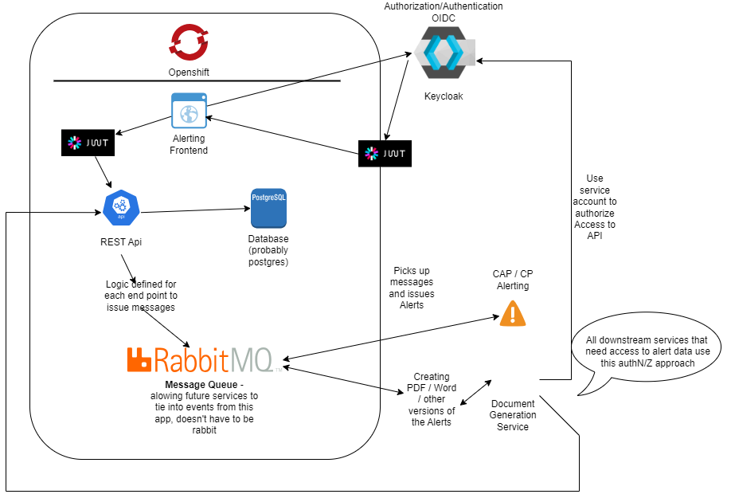

# nr-rfc-notifications
Notification / Alerting authoring application that will standardize and facilitate the issuing of warnings / alerts related to forecasted hydrological conditions

## Architecture

The following diagram displays the proposed architecture for the alert
authoring application.

