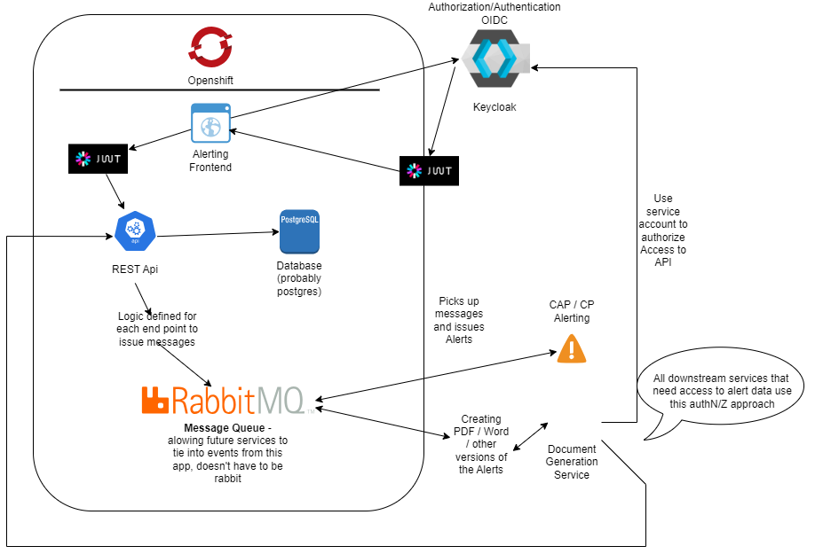

# Introduction

The following document provides detailed information on the components
that make up the architecture diagram below. This is a proposed architecture
for one possible approach.

## Keycloak / Single Sign on

Will use the existing keycloak service to provide the application with OIDC AuthN/Z
Information on keycloak integration:

* [SSO background information](https://bcgov.github.io/sso-requests)

Once we have a simple app created will request the SSO integration.

The diagram attempts to describe the authN/Z flow in a simplified way.  In 
a nutshell its a Proof of Key (PKCE) OIDC flow.  The frontend communicates with
keycloak eventually getting an access token in a Javascript Web Token format 
(JWT) which is consumed and verified by the frontend to Authenticate and Authorize
users, and it also uses this to authorize backend requests.

## Openshift

All the components that will be created to support the alerting app will 
be hosted on openshift.

Openshift namespaces have been provisioned.

## Alerting Frontend

Making the assumption that this will be some kind of typescript/javascript based
Single Page App (SPA) frontend, using one of the popular javascript/typscript 
frontend frameworks.  The application will have a public read only view that
displays a map with all the various alerts that are currently active for the province

Users will be able to click on individual events and see the information associated
with those events.

Authenticated users will have additional buttons populated, allowing for:
* Create New Alert
* Edit Existing Alert

**Create** will provide a new view that allows users to create a new alert.
**Edit** will prompt the user to select the event that they wish to edit on the map,
allowing them to update the alert

## Database

Likely use the postgres database that is already configured for deployment by the 
[quickstart template](https://github.com/bcgov/quickstart-openshift-backends).  The
template also includes functionality to address database backups.

## Deployments

Ideally re-use the quickstart to create an application deployment

* [base quickstart repo for node/typescript/javascript apps](https://github.com/bcgov/quickstart-openshift)
* [if using java/go/python backend](https://github.com/bcgov/quickstart-openshift-backends)

## Backend

The backend will be a pretty standard rest api.  It will be authenticated using 
the JWT that the frontend has negotiated with keycloak.  The backend will use logic
to fire off events to the message queue.

## Message Queue

The message queue, will essentially play the role of broker in between the alerting
authoring application and the downstream services that issue the actual alerts.  The
messages that are sent to the message queue will include the alert id, and a change
in the status.

## Alerting

This will be a completely separate service.  It will subscribe to the message queue, 
and will include logic that determines what needs to take place with respect to the 
issuing / updating / cancelling of alerts.  The message queue will only identify that
something has happened.  The alerting service will then communicate with the api 
using an api key, to pull any additional information necessary with respect to the 
actual alert event.

